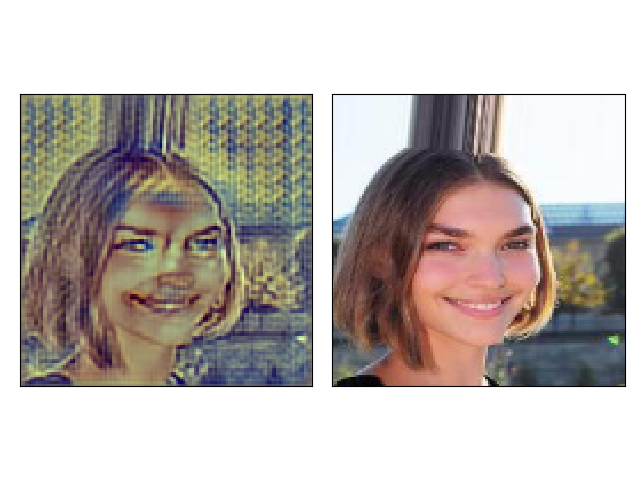
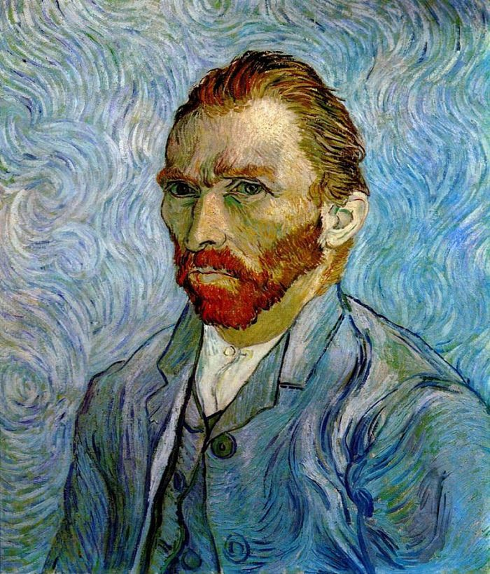

# Fast neural style transfer (in developement)

* With VGG16 loss head.
* With UNET fully convolutional net for image generation.

Current status :



From style image:



To train the network with CIFAR-10:

```bash
pipenv shell
pipenv install
pipenv run python train.py
```

### References

* Original source [J.C.Johnson](https://github.com/jcjohnson/fast-neural-style#models-from-the-paper).
* A residual PyTorch implementation [E. Linder-Norén](https://github.com/eriklindernoren/Fast-Neural-Style-Transfer)

## @Alex