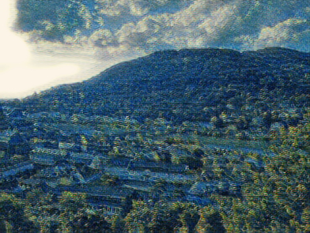

# Fast neural style transfer

* With VGG16 loss head.
* With UNET fully convolutional net for image generation.

From style images:

Van Gogh   | Picasso
:---------:|:--------:
 | 

To train the network with Imagenette:

```bash
pipenv shell
pipenv install
pipenv run python train.py --starry_night --width=<width_int> --height=<height-int>
```

## Examples

* Heidelberg

Original   | Van Gogh  | Picasso
:---------:|:---------:|:---------:
 |  | 

* Outside scene with friends

Van Gogh | Picasso
:-------:|:-------:
[](https://www.youtube.com/watch?v=ZjJtOnqJqIg) | [](https://www.youtube.com/watch?v=NzKcvEsIu4s)

* Mount Vesuvio's inside

Van Gogh | Picasso
:-------:|:-------:
[](https://www.youtube.com/watch?v=xirnt_-sChI) | [](https://www.youtube.com/watch?v=lfbySLIlNUk)


### References

* Original source [J.C.Johnson](https://github.com/jcjohnson/fast-neural-style#models-from-the-paper).
* A residual PyTorch implementation [E. Linder-Norén](https://github.com/eriklindernoren/Fast-Neural-Style-Transfer)

## @Alex